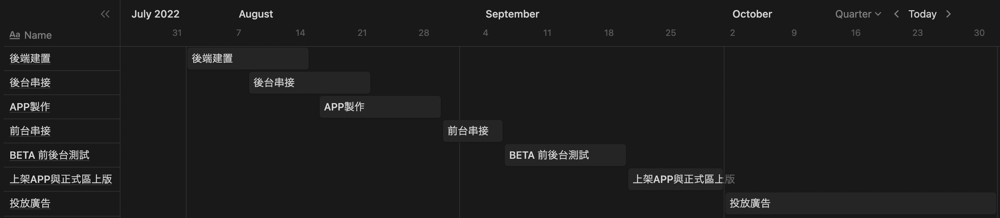
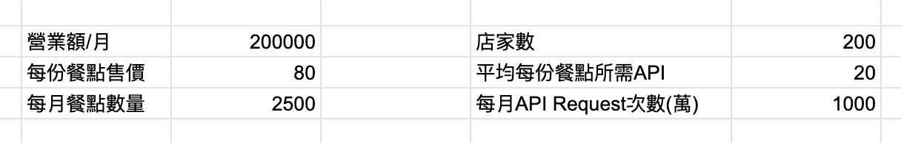
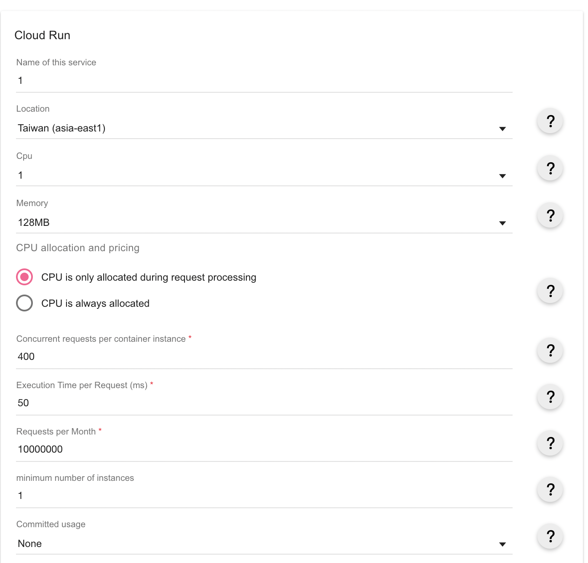
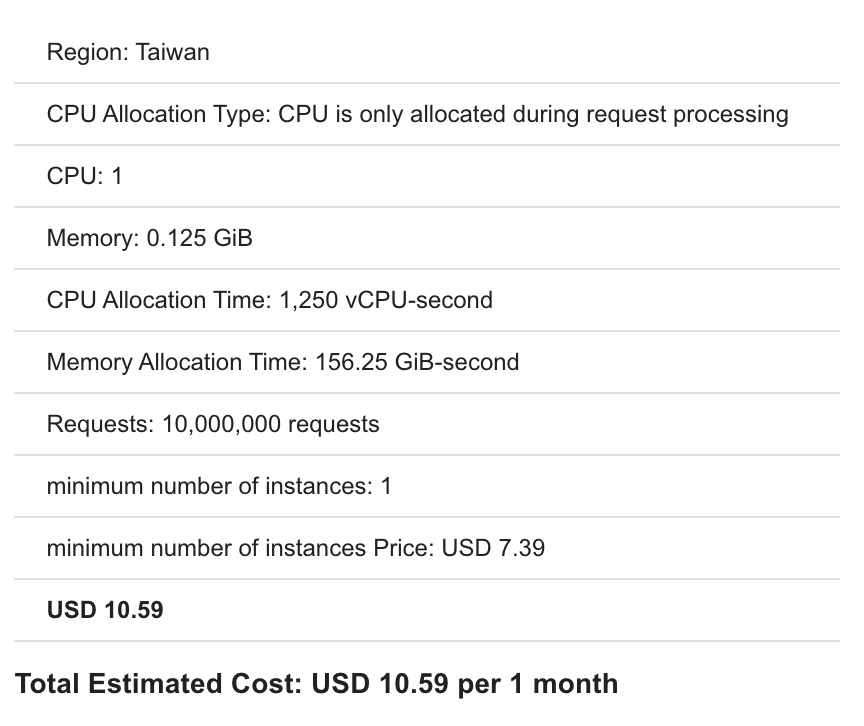
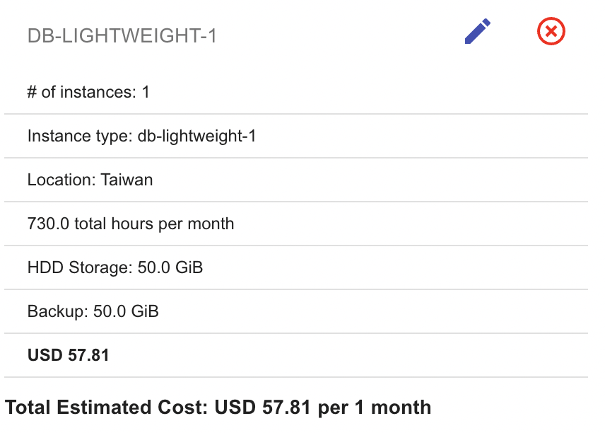
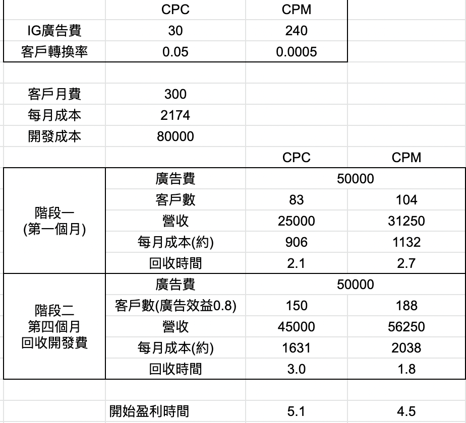

# 店家點餐系統

## 目標

> 使用SAAS協助小型餐廳建構自己的點餐系統,減少店家人力成本

## 內容要點

- POS系統普遍千元以上,並且需要走合約制,使用SAAS簡化建置流程與成本
- 具有硬體需要派人到府安裝,使用APP及網頁就可以達成遠距店家的建置,減少業務工作

## 實施對象

- 希望有訂單管理且想減少人力成本的小型餐廳
- 提供外帶快取的餐廳
- 不想支付高額手續費或系統購置成本的餐廳

## 實施範圍

- APP: 提供店家查看訂單狀況, 並在做完餐點後修改訂單成已完成
- 後臺網頁: 提供店家上架新菜色, 管理訂單並匯出報表
- 前台網頁: 提供內用桌號或外帶取餐時間, 選擇餐點後建立訂單, 如果登入的話可以選擇修改訂單

## 實施時間

## 所需經費

### 開發經費

- 後端工程師: 40000/月 * 2月 = 80000元
- 前端工程師: 40000/月 * 2月 = 80000元

### 營運經費 

圖片: CFimage $5/month

> 總額: $73.4/month = 2174台幣/month

## 預期效益

